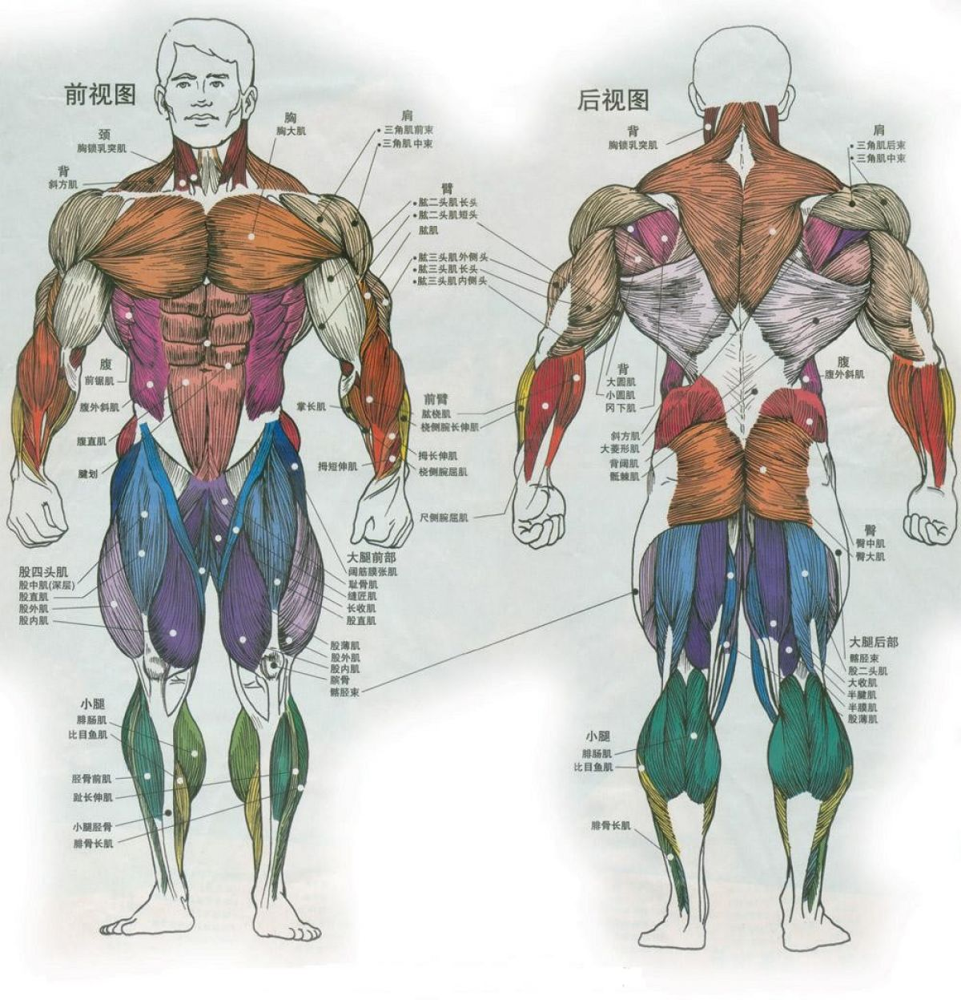

# 囚徒健身

其实早在大学时，我就注意到街头书摊有这套书了，但是**囚徒们**看的书，我怎么可以看呢？大学时除了有点抑郁外，身体并没有什么痛苦，跑个步足以让自己轻松很多。

等到参加工作后，各种职业病苗头的出现才让我开始探索各种健身方式，中间也走了不少弯路。后来可能受了某些网友的影响，才开始看这个系列的书。

我认同书中的大多数观点，只是我认为健身应该是件比较快乐的事情，因而我不会强迫自己按照某些枯燥的计划去锻炼。

刚开始锻炼时，我们只会注意表层的肌肉长大没有，其实深层肌肉的强壮比表层肌肉强壮要重要的多。深层肌肉的强壮需要用平衡性、灵活性来度量，最近Boston Dynamic的机器人可以跑酷了，这让人十分震撼！如果你做的机器人又笨又大，没有多少人会喜欢，但如果你的机器人小巧又灵活，就会变得非常有价值。

很多时候我们并不知道自己到底要追求什么，什么才是最重要的，要走很多弯路才能找到正确的方向。
