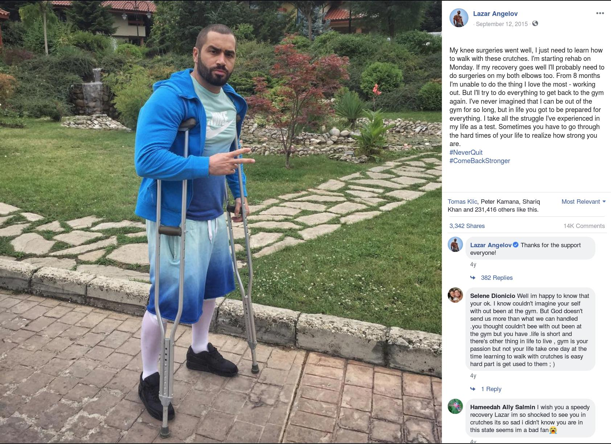

# 囚徒健身

## 目录
    - [第一册](gbook_1/)
        - [俯卧撑](gbook_1/push_ups)
        - [引体向上](gbook_1/pull_ups)
        - [倒立撑](gbook_1/handstand_pushups)
        - [桥](gbook_1/bridge)
    - [第三册](gbook_3/)
        - [后翻](gbook_3/back_flip/)

## 前言

其实早在大学时，我就注意到街头书摊有这套书了，但是**囚徒们**看的书，我怎么可以看呢？大学时除了有点抑郁外，身体并没有什么痛苦，跑个步足以让自己轻松很多。

等到参加工作后，各种职业病苗头的出现才让我开始探索各种健身方式，中间也走了不少弯路。后来可能受了某些网友的影响，才开始看这个系列的书。

我认同书中的大多数观点，只是我认为健身应该是件比较快乐的事情，因而我不会强迫自己按照某些枯燥的计划去锻炼。

刚开始锻炼时，我们只会注意表层的肌肉长大没有，其实强壮的深层肌肉比强壮的表层肌肉要重要的多。强壮的深层肌肉需要用平衡性、灵活性来度量。最近Boston Dynamic的机器人[Atlas可以跑酷了](https://youtu.be/_sBBaNYex3E)，这让人十分震撼！如果你做的机器人又笨又大，没有多少人愿意买单，而如果你的机器人小巧又灵活，就会变得非常抢手。

很多时候我们并不知道自己到底在追求什么，什么才是最重要的，要走很多弯路才能找到正确的方向。

我刚开始想练成Lazar Angelov的样子，感觉那样会受到妹子们的欢迎，现在我只想做我自己。他的健身理念跟囚徒健身完全相反，典型的三分练七分吃，负重训练，只注重表层肌肉，这些年我从没见他做过一个高难度的动作(空翻、倒立、双立臂)，并且他把自己的关节都给毁了，实在是可惜。

