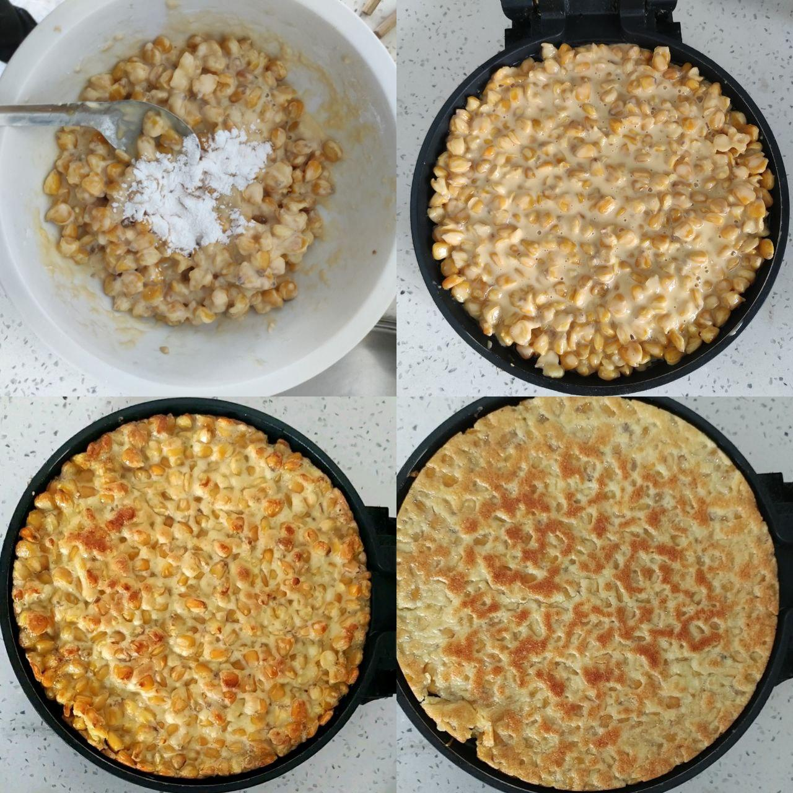

# 玉米

可以选用鲜玉米或者玉米罐头。考虑到我家有很多熟玉米，为了充分利用资源，我这里选择熟玉米。

用的是去年秋天的熟玉米，干透了，总共600克。先清洗几遍后，在太阳下泡6个小时，然后小火煮一个多小时就变软了。煮熟的玉米重量接近1180多克，考虑到我中间尝了几次，差不多翻倍了。

去年第一次尝试时，泡了一晚，给泡坏了！第二次煮了三四个小时才变软。

今年的改动有❶减少总量，❷泡的时间不太短也不太长，❸煮的时候每隔一二十分钟搅拌一次。所以只用一个多小时就煮好了。

## 玉米烙

 - 配料：玉米、面粉、鸡蛋、糯米粉、油、盐。

做饼的配料可以根据自己的喜好调整。

## 加在粥/米饭中

## 做玉米馅儿的包子(还没尝试)

