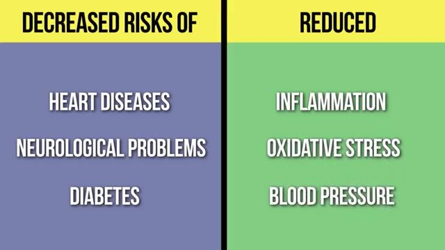
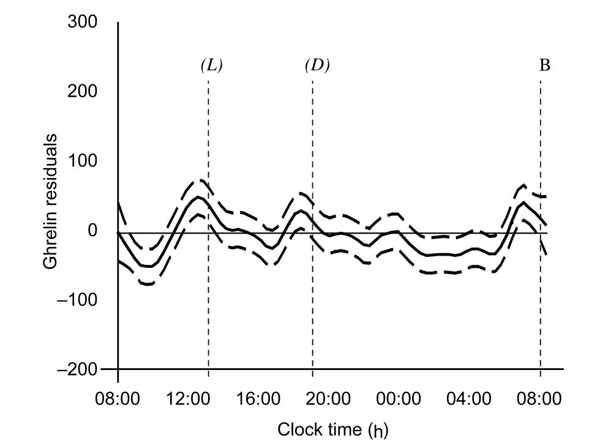

# 饮食

现在人们因为压力过大、睡眠不足容易导致养成不良的饮食习惯，很多年轻人早早患上各种疾病，实在是可惜。

适当保持一点饥饿感对我们的身体健康有很大的好处，[A One-Day Starvation Secret Got the Nobel Prize](https://youtu.be/gl8k2ncIQMc)中讲：

>间歇性禁食可以降低心脏病、神经系统疾病和糖尿病的风险，减少发炎、氧化压力和高血压等症状，最重要的是可以预防癌症，延长寿命，平衡胆固醇水平。

饥饿感像波浪一样，即使你啥也不吃，过了那阵儿也就没感觉了。想要调整自己不良的饮食习惯，只要坚持过头4天就好办了，你的身体很快就会适应过来。

**Antifragile**一书的第22章*To Live Long, but Not Too Long*中，作者讲了下面一些话：

>I am convinced (an inevitable result of nonlinearity) that we are antifragile to randomness in food delivery and composition—at least over a certain range, or number of days.

>Indeed, the idea of breakfast as a main meal with cereals and other such materials has been progressively shown to be harming humans—I wonder why it took so long before anyone realized that such an unnatural idea needs to be tested; further, the tests show that harm, or, at least, no benefits are derived from breakfast unless one has worked for it beforehand.

作者认为人体并没有那么脆弱，并不需要每天都保持均衡的营养。他还认为早餐前如果没有为此付出一点代价(运动)，那早餐就是有害的(至少没啥好处）。

## 一些粗粮的食用方法

 - [玉米](Corn/)

## 间歇性禁食的一点经验

2020年以来，我尽量每天两餐，最开始晚上会吃零食和水果，之后尽量避免。2022年之后，几乎是只有每天中午吃一餐，偶尔会在傍晚吃点水果和零食。

2022年3月28日是我第一次尝试禁食一整天，也不吃水果和零食，只喝水。可能因为过渡比较平缓，并且禁食前几天清心寡欲，内心平静，所以很容易做到。

根据我对自己的观察，吃太多有这些坏处：

 - 肠胃的工作负担很大
 - 大脑的注意力、思考能力下降
 - 身体反应速度下降
 - 免疫力下降
 - 更容易追逐低级趣味
 - 高效做事的时间更短

疫情封锁让一些网友想要尝试辟谷，我感觉这可能不太容易做到。因为你很难一下子从大量内耗(精神压力)变得恬淡虚无。

人的身体是反脆弱的。一日规律的三餐、在压力下为了赚钱每天长时间工作其实是违背自然规律的，这样既会让身体变得脆弱，也很难(健康的)长期坚持下去。我们应该善待自己。

最近看的一些关于肠道细菌的视频，让我相信人与人的个体差异是很大的。通过对我自己和家人的长期观察，也可以印证这种想法。所以我的经验仅供参考，你应该相信自己的感受。

我一次可以打坐半小时，平时做事比较容易全身心投入，新陈代谢比上学、工作时要慢，吃多了撑的难受，只有少吃才能有更多时间高效做事。

而我的家人们习惯了忙忙碌碌，做一件事同时考虑很多其它事情。他们没有人能够双盘坐，即使单盘也很难坚持5分钟，每天必须按时吃三餐还得加零食。几十年的习惯，难以改变！

## Books

|Title|Author|Year|
|:-|:-|:-:|
|The Diabetes Code: Prevent and Reverse Type 2 Diabetes Naturally|Jason Fung|2018|
|The Case Against Sugar|Gary Taubes|2016|
|Grain Brain: The Surprising Truth about Wheat, Carbs, and Sugar--Your Brain's Silent Killers|David Perlmutter, Kristin Loberg|2013|
|Antifragile: Things That Gain From Disorder|Nassim Nicholas Taleb|2012|

## Videos

 - [Leptin & Insulin Resistance Balancing Tips w/ Jason Fung, MD](https://youtu.be/jXXGxoNFag4)。
 - [一日飢餓秘密獲得諾貝爾獎](https://youtu.be/gXC6LHkUPnE)
 - [A One-Day Starvation Secret Got the Nobel Prize](https://youtu.be/gl8k2ncIQMc)
 - [A Nobel Prize Diet That Will Help You Look Younger](https://youtu.be/bo2n50O3orY)
 - [Intermittent Fasting & Hunger - What the Science says](https://youtu.be/dFT2IKmwyfg)
 - [Leptin & Insulin Resistance Balancing Tips w/ Jason Fung, MD](https://youtu.be/jXXGxoNFag4)
 - [Longevity & Why I now eat One Meal a Day](https://youtu.be/PKfR6bAXr-c)
 
## Reference

 - [Eating Once a Day: Questions](https://lifeforbusypeople.com/2016/09/06/eating-once-a-day-questions/)
 - [Spontaneous 24-h ghrelin secretion pattern in fasting subjects: maintenance of a meal-related pattern](Papers/d7e6345d3b32cd147ef7b47e6d0ff5243882.pdf)
 - [2015–2020 Dietary Guidelines for Americans](https://health.gov/dietaryguidelines/2015/)
