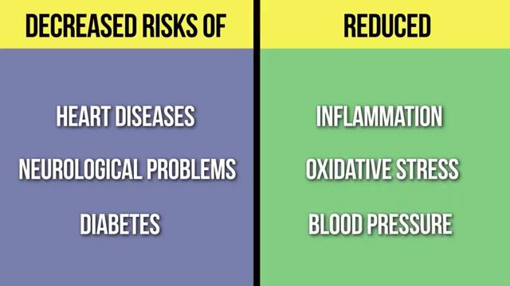
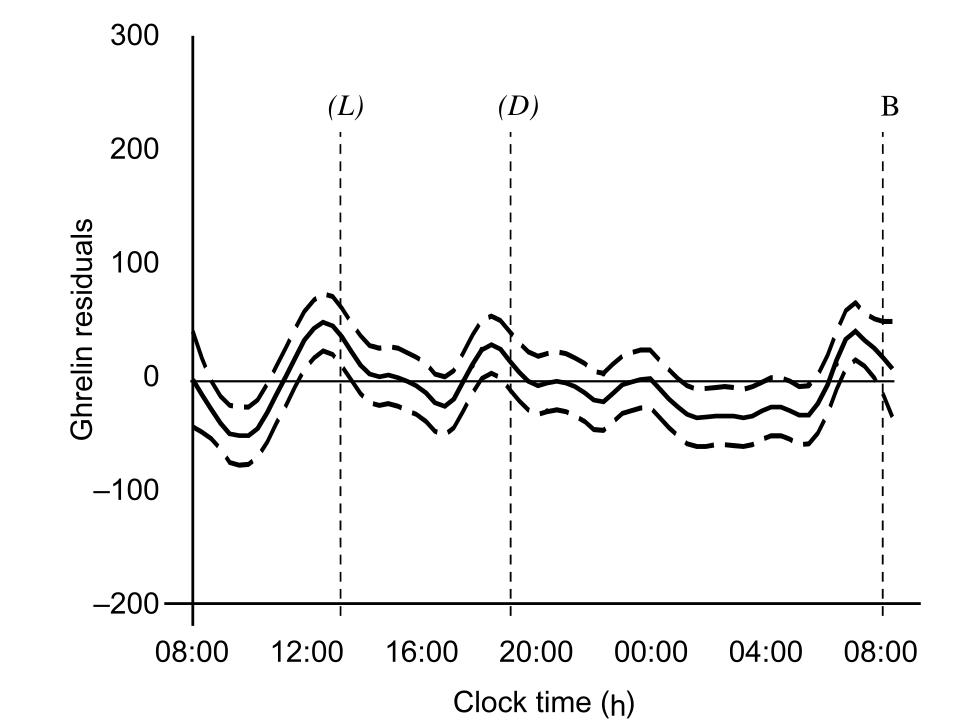

# 饮食

现在人们因为压力过大、睡眠不足容易导致养成不良的饮食习惯，很多年轻人早早患上各种疾病，实在是可惜。

适当保持一点饥饿感对我们的身体健康有很大的好处，[A One-Day Starvation Secret Got the Nobel Prize](https://youtu.be/gl8k2ncIQMc)中讲：

>间歇性禁食可以降低心脏病、神经系统疾病和糖尿病的风险，减少发炎、氧化压力和高血压等症状，最重要的是可以预防癌症，延长寿命，平衡胆固醇水平。

饥饿感像波浪一样，即使你啥也不吃，过了那阵儿也就没感觉了。想要调整自己不良的饮食习惯，只要坚持过头4天就好办了，你的身体很快就会适应过来。

## Books

|Title|Author|Year|
|:-|:-|:-:|
|The Diabetes Code: Prevent and Reverse Type 2 Diabetes Naturally|Jason Fung|2018|
|The Case Against Sugar|Gary Taubes|2016|
|Grain Brain: The Surprising Truth about Wheat, Carbs, and Sugar--Your Brain's Silent Killers|David Perlmutter, Kristin Loberg|2013|

## Videos

 - [Leptin & Insulin Resistance Balancing Tips w/ Jason Fung, MD](https://youtu.be/jXXGxoNFag4)。
 - [一日飢餓秘密獲得諾貝爾獎](https://youtu.be/gXC6LHkUPnE)
 - [A One-Day Starvation Secret Got the Nobel Prize](https://youtu.be/gl8k2ncIQMc)
 - [A Nobel Prize Diet That Will Help You Look Younger](https://youtu.be/bo2n50O3orY)
 - [Intermittent Fasting & Hunger - What the Science says](https://youtu.be/dFT2IKmwyfg)
 - [Leptin & Insulin Resistance Balancing Tips w/ Jason Fung, MD](https://youtu.be/jXXGxoNFag4)
 - [Longevity & Why I now eat One Meal a Day](https://youtu.be/PKfR6bAXr-c)
 
## Reference

 - [Eating Once a Day: Questions](https://lifeforbusypeople.com/2016/09/06/eating-once-a-day-questions/)
 - [Spontaneous 24-h ghrelin secretion pattern in fasting subjects: maintenance of a meal-related pattern](Papers/d7e6345d3b32cd147ef7b47e6d0ff5243882.pdf)
 - [2015–2020 Dietary Guidelines for Americans](https://health.gov/dietaryguidelines/2015/)