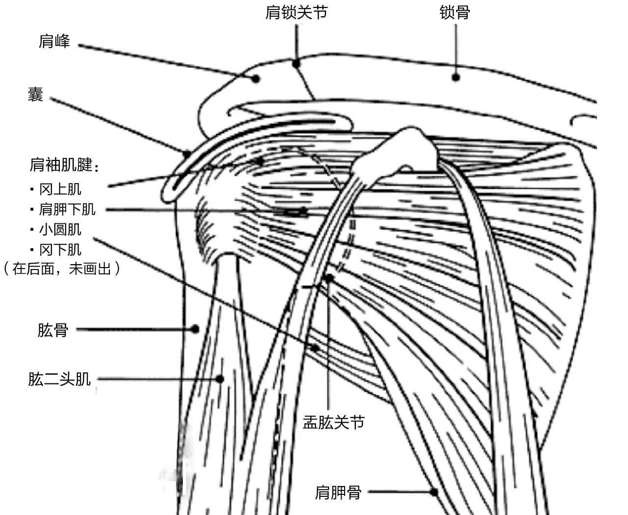
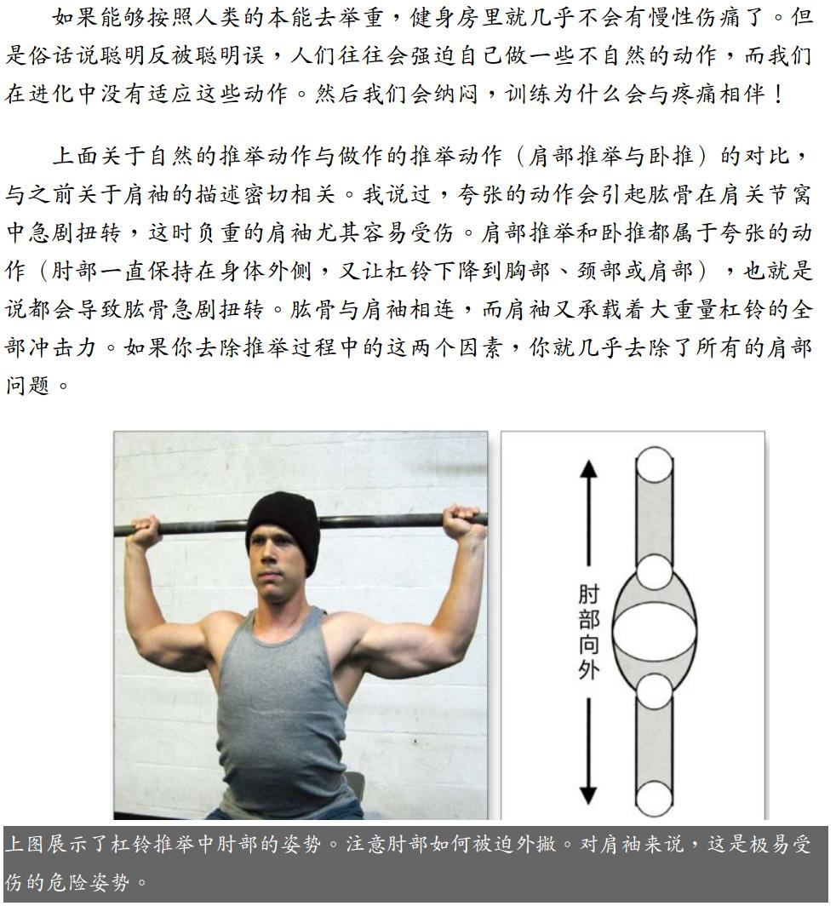

# 肩袖

>时间：大约是2018年5月10号
地点：附近小区旁的广场
动作：颈后引体/Behind the neck pull ups

当时练引体遇到了瓶颈，很长时间数量没有提高，后背肌肉也没酸痛的感觉，因为从网上看到人们说颈后引体可以刺激背阔肌，并且我看过Jason Statham练习这个动作的[视频](https://www.youtube.com/watch?v=yyh90LVG6KE)，于是尝试做了几个颈后引体，可能当时我两手距离太近，也可能我拉得太靠上了，感觉肩部刺痛，马上就跳下来了。

接下来很长时间，我的一个肩膀在一些角度都很难发力，导致很多常做的动作都无法进行下去，一直到四个月后，都还没有完全恢复。

2019年5月18号，受伤已经一年多一点了，我感觉基本完全恢复了，在充分热身后，小心尝试这个动作，这次做的很不错。这一年多，我并没有静养，而是不停的去做我可以做的项目。

囚徒健身中的倒立撑一章，关于肩部伤痛的观点，我认为很有道理，截图中的动作跟颈后引体的姿势很像。

## Reference

[Should you do Behind The Neck Exercises?](https://youtu.be/ak04ZEzPAuU)
