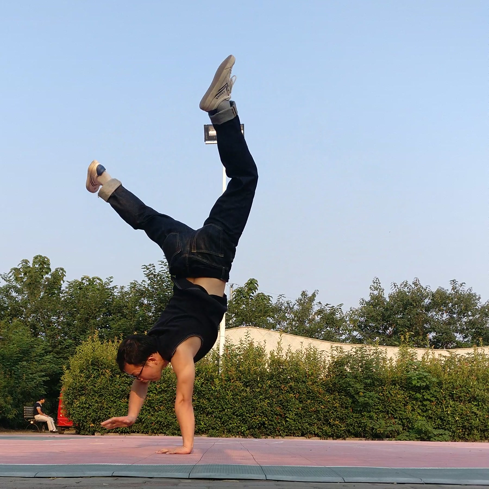
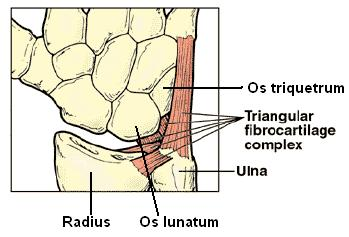
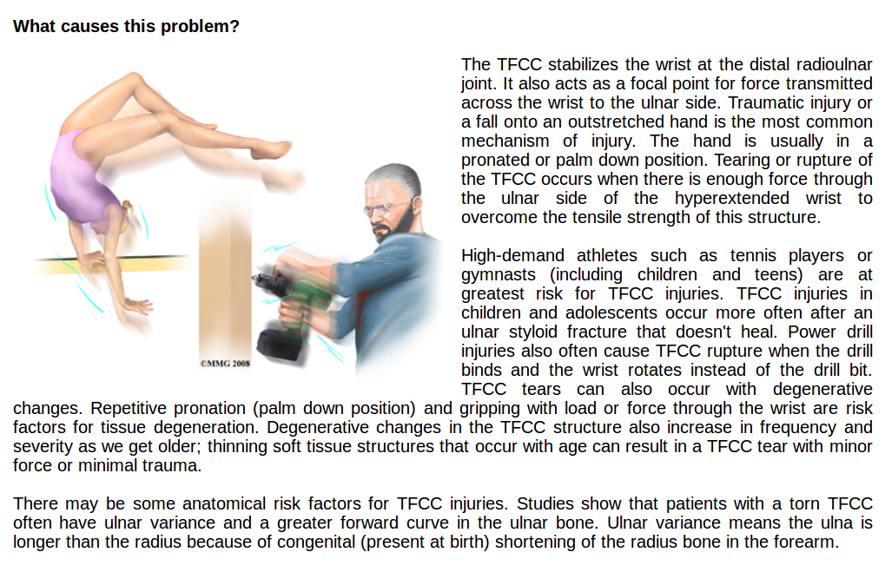

# TFCC/手腕三角纤维软骨复合体损伤

 - 时间：2019年9月3日早晨
 - 地点：篮球场
 - 动作：自由倒立

当时温度比较低，由于热身不够充分，倒立失去平衡时崴到左手腕。当天中午端碗吃饭都有些费劲，接下来几天左手也不太敢做推的动作，但我每天都在练单杠悬垂之类拉的动作。

十多天后可以正常做俯卧撑，但是做单杠pullover时还有些不适。二十多天之后可以小心尝试自由倒立，可以做绝大多数常练的动作。35天之后，基本完全恢复。

# Reference

 - [Triangular Fibrocartilage Complex (TFCC) Injuries ](http://www.sportsrehabu.com/Injuries-Conditions/Wrist/Wrist-Issues/Triangular-Fibrocartilage-Complex-TFCC-Injuries/a~6405/article.html)