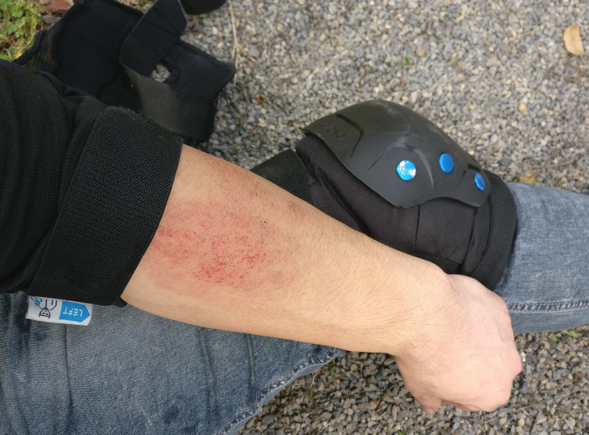
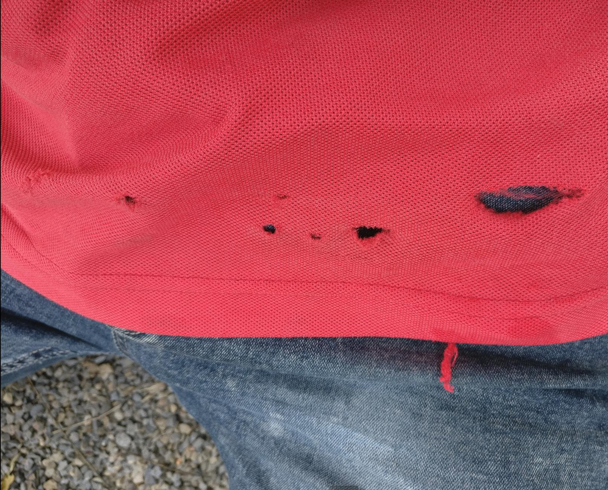
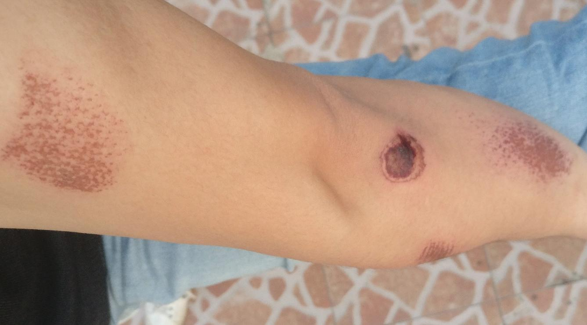

# 左臂多处擦伤

- 时间：2019年9月28日上午
- 地点：下坡
- 动作：轮滑刹车

当天穿着轮滑鞋准备跑到8公里外的一座山脚下，然后脱了鞋爬山，去的时候有一个下坡，人少车少，我的速度估计超过30km/h了，当时也想要刹车，但是单脚根本站不稳，好在后面马上就是上坡。接下来的路很累，比在平路上累多了，我在半路上看到一些健身设备，就过去玩了会儿，喝了点水，恢复体力后接着向后滑，等到一个岔路口后我不知道向那个方向走，随便选了一个方向，发现前方可能在施工，当时时间也不早了，决定原路返回。

转身发现这速度加的太快了，我试图用平时的转弯法刹车，结果摔趴下了！站起来打算跳过减速带，没站稳又跑到草丛中了。我小心翼翼的像下台阶一样侧身跨过减速带到了岔路口，刚一转身，发现速度又无法控制了，好在我一直保持下蹲前倾的姿势，所以摔得并不算严重。接下来，路上也基本没人，像来的时候快速滑回去吧，但是几秒钟后我就后悔了，我想S行滑行让速度慢下来，可是根本没用，再一次仆街。爬起来后我想着用内八字减速滑行，可是平时没怎么练过，再次仆街。

当时我都不太想起来了，但是趴大马路上也不是办法，我走到路边，小坐一会儿，思考怎么走接下来的路，最后决定不停的用T刹减速。当速度快起来后单脚根本站不稳，所以必须始终把速度控制在较低的水平，接下来很顺利，几公里我一次也没摔。

这次我穿的短袖，所以胳膊擦伤了，短袖和裤子都擦破了几个洞，我想以后我一定会穿厚实的长裤长袖出来，实在是伤不起。

