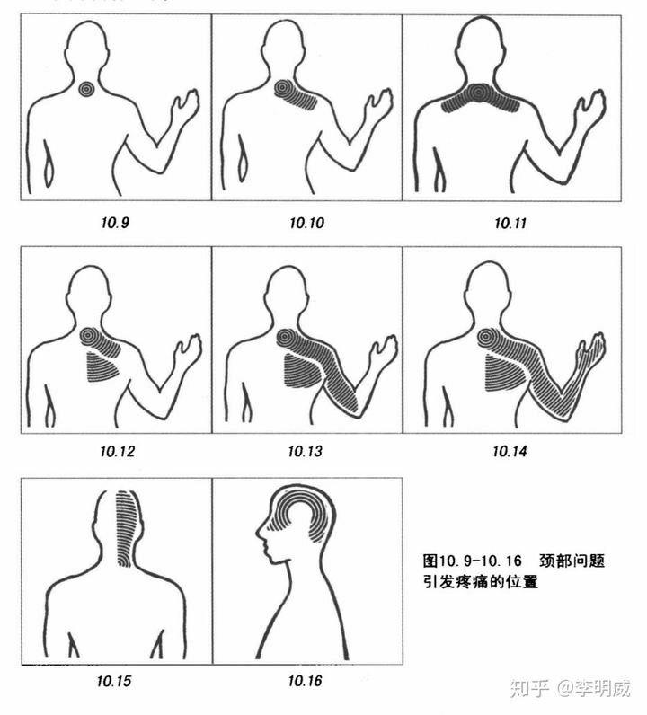

## “病入膏肓”可能是颈椎病

2021年2月28日：

>昨天下午四点多钟，从电脑前站起来，突然发觉后背有点疼痛，我起来活动了下依然没有缓解，刚开始以为是颈椎病什么的，骑车到几公里外练了下单杠，发现可能跟背阔肌的根部有点关系。

>晚上看书并没有什么明显的感觉，但等我睡觉时，不论左侧睡还是右侧睡，都挺难受，好不容易找到个相对舒适的姿势，半夜睡梦中翻身，居然给痛醒了。我缓缓的从床上爬起来，甚至怀疑是不是胸椎骨折了，要不要等天亮后到医院拍个片子。

>我感觉这有可能是前天下午那么冷的天练自由倒立造成的，也有可能是那天晚上翻越障碍造成的。

>今天早上到YouTube看背痛相关的视频，刚开始发现可能是胸腰筋膜受损，原因可能是某个动作用力过度。后来发现有可能是长期做在电脑前，让大小菱形肌受损。

>看了一集视频《病入膏肓！？躺著也痛、坐著也痛該怎麼解決？》，原来肩胛骨内侧这个地方是膏肓穴，听起来挺可怕的。

>下午打坐一会儿，躺在床上寻找痛点，发现很难说清到底哪个部位疼，当把脖子向后仰时，感觉似乎是脊椎右侧疼，背朝后往床上躺的时候，感觉是菱形肌部位疼。

2021年3月4日:

>这些天来，本来已经慢慢缓解，但今天早起又有加剧的感觉，我这才怀疑是颈椎病。看了一些帖子，发现我犯了个十分愚蠢的错误，显示器高度在最低点！
今天把显示器调高了几十公分，打算晚上也少用手机和Kindle。

>不舒服的位置很10.12有点像，最开始偏右下，后来又感觉在中间，最近有感觉是中上部，也摸不出痛点

>今晚锻炼后，已经比早起好多了。昨天大意了，以为就要完全恢复了，晚上又抱着笔记本电脑看了几个小时。

根据日记，到3月7日，基本康复。
