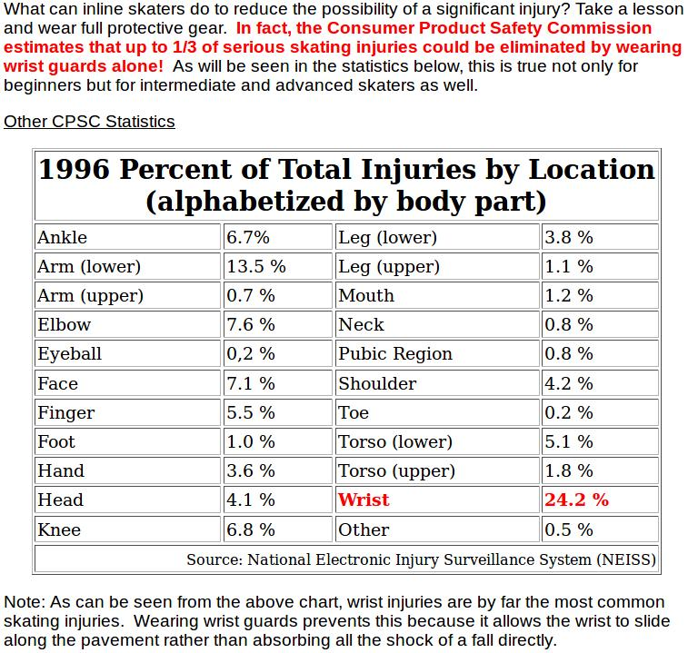
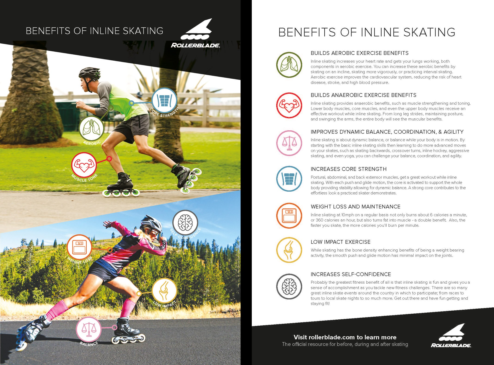

# 轮滑

轮滑运动有一定的危险性，建议先通过**囚徒健身**中的*六艺*把身体素质提上去，再去尝试。

轮滑运动相对其它运动受伤率似乎更低，可能是因为轮滑玩家比其它运动的玩家身体素质更好。还有一点就是，刚开始玩时人们可能会摔得比较惨，因而安全意识相对更高。

轮滑最好配合着其它运动一起练，练前适当热身，练后拉伸一下，并且要不时光脚锻炼下足部肌肉。

我现在累计滑行时长应该超过30小时了，当我滑行超过10公里时，会感觉左腿膝盖有点不适，可能是我运动强度有点大吧，不过一般坐下休息一会儿膝盖就没太大感觉了。

 - [轮滑运动的益处](https://www.rollerblade.com/the-rollerblade-experience/fitness/benefits-of-inline-skating-2/)

 - [轮滑鞋选购指南](http://www.skatefaq.com/buyingguide.html)
 - [轮滑刹车、倒滑、下坡技巧](http://www.skatefaq.com/stopping.html)

## 视频教程

国内Bilibili上的**柚子轮滑**、**淼哥带你飞**系列视频可以用来入门。

 - [Bill Stoppard Skating BSS](https://www.youtube.com/channel/UCp0VcHDRMfof2wCod5vF6rQ)

 - [超酷！武汉84岁爷爷穿轮滑鞋环游世界，已经去过90多个国家 | 二更](https://www.youtube.com/watch?v=pEL1CuCSPPw)
 
 - [西湖边最帅背影，让无数姑娘追着抓拍，还被央视直播？！| 二更](https://www.youtube.com/watch?v=erBliLcfFfU)
 
一些摔倒的视频

 - [Slams & Fails - inline skate bloopers section from PARTY](https://www.youtube.com/watch?v=DxiS3jIWwOk)
 - [WASTED Rollerskate fails of 2017](https://www.youtube.com/watch?v=9INdAsU-tHA)
 - [Roller Skate FAILS 2018!](https://www.youtube.com/watch?v=jYSsBJJiXUs)

## Reference

 - [My Knees Always Hurt, What’s Up?](https://derbyinmotion.wordpress.com/my-knees-are-killing-me/)
 - [Asha’S Advice For Inline Skating Knee Pains](https://skatefresh.com/inline-skating-knee-pains/)
 - [Is roller/inline skating a sport that oftenly leads to knee injuries like running?](https://www.quora.com/Is-roller-inline-skating-a-sport-that-oftenly-leads-to-knee-injuries-like-running)
 - [Inline Skating Safety Statistics](https://www.iisa.org/resources/safety.htm)