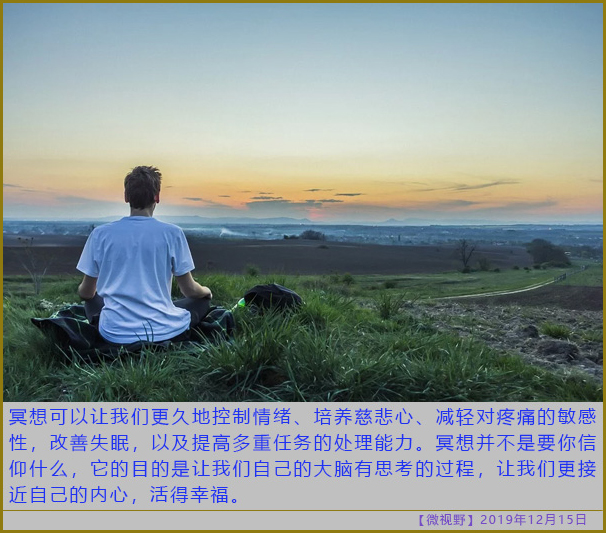

# 静坐

成年之后，我们每天思考的东西太多了，但是有很多问题不是我们思考就可以解决的，有时候放慢节奏，让自己静下来，或许对自己更好。

乔布斯、比尔盖茨、尤瓦尔·赫拉利或早或晚都开始做这件事了。如果想要看相关的书，可以参考《因是子静坐法》。我已经忘记书中讲的什么了，静坐时也没有什么宗教的神圣感，只是熄灯闭目，关注呼吸，努力不去思考任何问题，获得片刻的安宁。

最近听一个健康讲座了解到**缺血预适应**这个概念，我认为佛学瑜伽中的双盘坐应该能达到类似的效果，并且还不需要购买其它设备。

## 缺血预适应（ischemic preconditioning，IPC）

>机体部分器官（如上肢）在受到短暂的、可逆性缺血缺氧刺激后，通过诱导缺血器官以外的其他脏器（如心脏、大脑、肝脏、肾）对随后发生的严重或致命的缺血缺氧产生保护作用。

 - 保护心肌，防治心梗、脑梗、中风等心脑血管疾病，同时可用于支架手术（经皮冠状动脉腔内成形术）患者术前、术后的辅助治疗作用
 - 抗缺血，减轻缺血、缺氧反应，增强血管功能，增强人体抵抗力及运动能力
 - 激活人体内源性物质一氧化氮、腺苷、缓激肽的产生
 - 促进血液和组织液循环，缓解肢体水肿和疼痛