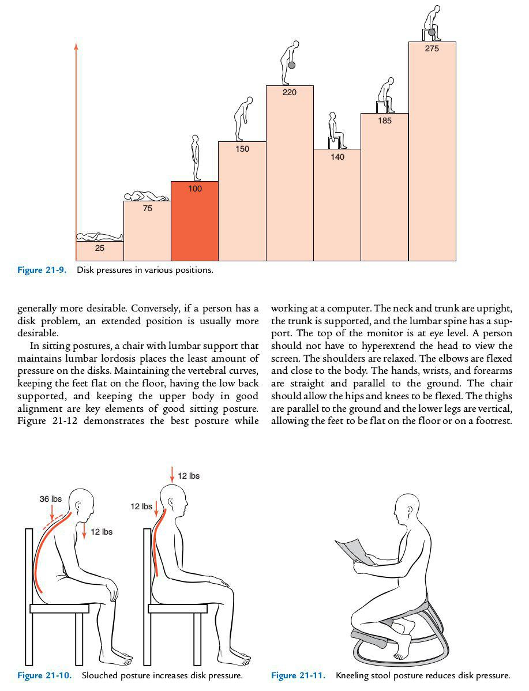

# 腰部

现在人们每天坐十来个小时很常见，长时间如此我们的腰部很难受，因为我们的身体并不适合整天坐着。我个人认为并没有一个正确的坐姿，可以保证你长期坐着身体不出毛病。我们应该每天抽出一段时间给腰部减压，单杠运动就很不错。

刚开始你可以选择单杠悬垂，甚至是找个矮杠把脚放在地上缓解手臂上的拉力，等上肢强壮起来后，可以玩很多单杠上的花样。

也可以考虑爬行，我现在每隔几天都会爬一次，每次两组共200步左右，前期可以爬的少一点。

## Reference

 - Clinical Kinesiology And Anatomy, 5th Edition