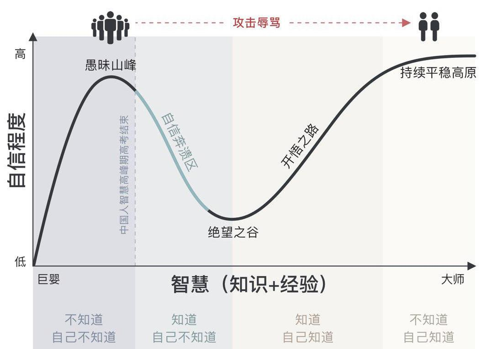
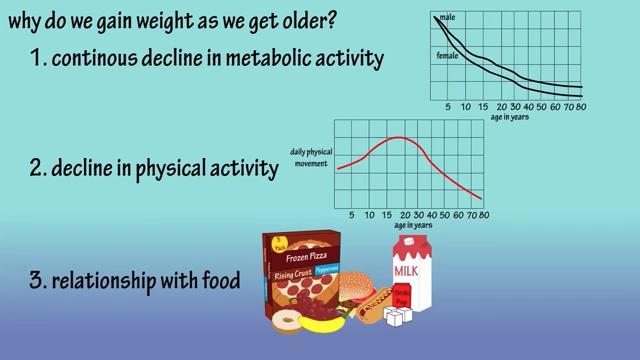

# 徒手健身

俗话说，健身先健脑。我们看看当年[Bertrand Russell](https://www.goodreads.com/author/quotes/17854.Bertrand_Russell)是怎么说的：

 - In all affairs it's a healthy thing now and then to hang a question mark on the things you have long taken for granted.
 - Men are born ignorant, not stupid. They are made stupid by education.
 - Do not fear to be eccentric in opinion, for every opinion now accepted was once eccentric.
 - The fundamental cause of the trouble is that in the modern world the stupid are cocksure while the intelligent are full of doubt.
 - I would never die for my beliefs because I might be wrong.
 - 在所有事务中，时不时地在您早已视为理所当然的事情上打上问号是一件健康的事情。
 - 人生而无知，但是并不愚蠢，是教育使人愚蠢。
 - 不要为自己持独特看法而感到害怕，因为我们现在所接受的常识都曾是独特看法。
 - 不用盲目地崇拜任何权威，因为你总能找到相反的权威。
 - 这个世界的问题在于聪明人充满疑惑，而傻子们坚信不疑。
 - 我绝不会为我的信仰而献身，因为我可能是错的。

这个视频 [Why do we get fat - Why do we gain weight as we get older](https://youtu.be/STr9ON9-4bU) 告诉我们，中老年人发福的主要原因有三个：

 - 新陈代谢水平持续下降
 - 运动量不断较少
 - 饮食不加节制

---

对于经常加班的网友，我建议在保证较为充足睡眠的情况下，再适当锻炼，不要盲目攀比。同时也应该调整自己的饮食方式，早餐和午餐好好吃，晚上少吃点，防止变成肥宅。想要拥有健康的身体，就应该把睡觉放在第一位，饮食放第二位，锻炼放第三位。

健身时，要追求尽可能有实用价值的动作，尽可能少或不用其它专业器械。**囚徒健身/Convict Conditioning**对我影响很深，但我并没有完全遵守上面的健身计划，我不想让锻炼成为一件痛苦的事情，让健身变得快乐有趣，才有可能长期坚持下去。

人跟机器是很不一样的，有些人误以为像**一拳超人**中讲的`每天做100个俯卧撑，100个仰卧起坐，100个深蹲和跑10km`是一个好的健身计划，其实真的这样锻炼不仅让我们对运动越来反感，也会严重伤害我们的身体(大负荷运动身体需要恢复时间)。在睡眠不充足的情况下剧烈运动更容易促发心源性猝死，请善待自己的身体。

我认为好的健身计划是，你根据天气和身体状况选择当天更喜欢的运动，每隔一段时间要调节一下运动难度，毕竟我们喜欢新鲜感，一眼看到头的健身计划很难让人提起兴趣。

引用[读书笔记：《反脆弱——从不确定性中获益》](https://program-think.blogspot.com/2018/12/Book-Review-Antifragile-Things-That-Gain-from-Disorder.html)中的一个表格：

|机械体，非复杂系统|有机体，复杂系统|
|:-|:-|
|需要持续修复和维护|自我修复|
|厌恶随机性|喜欢随机性（小幅变化）|
|无须恢复|在受压后需要恢复|
|组成部分相互依赖【很低或没有】|组成部分相互依赖【很强】|
|【存在】压力导致材料疲劳|【缺乏】压力导致萎缩|
|【常用】导致老化	|【闲置】导致老化|
|在冲击下会反应【不足】|在冲击下会反应【过度】|
|时间只会带来老化|时间带来老化和衰老|

## 目录

 - [睡觉](Sleep/)
 - [饮食](Diet/)
 - [囚徒健身](Convict-Conditioning/)
    - [第一册](Convict-Conditioning/book_1/)
        - [俯卧撑](Convict-Conditioning/book_1/push_ups)
        - [引体向上](Convict-Conditioning/book_1/pull_ups)
        - [倒立撑](Convict-Conditioning/book_1/handstand_pushups)
        - [桥](Convict-Conditioning/book_1/bridge)
    - [第三册](Convict-Conditioning/book_3/)
        - [后翻](Convict-Conditioning/book_3/back_flip/)
 - [**轮滑**](Inline-Skates/)
 - [**爬行**](Crawl/)
 - [跑步](Run/)
 - [跳远](Long-Jump/)
 - [静坐/冥想](Meditation/)
---

 - [职业病](Occupational-Disease/)
    - [眼睛](Occupational-Disease/Eyes/)
    - [头发](Occupational-Disease/Hair/)
    - [腰部](Occupational-Disease/Waist/)

---
 
 - [受伤及恢复过程](Injuries-and-Healing/)
    - [2018-05-10：颈后引体导致肩袖受伤](Injuries-and-Healing/180510)
    - [2019-08-28：轮滑高速转弯时侧翻导致右大腿外侧摔伤](Injuries-and-Healing/190828)
    - [2019-09-03：热身不充分时自由倒立导致手腕三角纤维软骨复合体损伤](Injuries-and-Healing/190903/)
    - [2019-09-28：轮滑下长坡时无法控制速度多次摔倒导致皮肤擦伤](Injuries-and-Healing/190928/)
    - [2020-05-22: 不明原因胸痛](Injuries-and-Healing/200522/)
	- [2020-11-12: 低血糖](Injuries-and-Healing/201112/)
	- [2021-02-28: “病入膏肓”可能是颈椎病](Injuries-and-Healing/210228/)

## 让运动变得更加有趣

最近这两年来，我都会为自己录制剪辑健身视频，看着自己不断进步，感觉更加容易坚持下去。我还会制作一些特别的效果，比如镜像、倒放之类，我曾把穿着轮滑鞋在单杠做Pull Over时的下落过程做成倒放效果，会给人一种我在做双立臂的感觉。

## Reference

 - [What You'll Wish You'd Known](http://paulgraham.com/hs.html)
 - [Why do we get fat - Why do we gain weight as we get older?](https://youtu.be/STr9ON9-4bU)
 - [北京市公安局特警队员体能及身体素质标准](http://www.bjgwy.org/201611/442.html)
 - [The health hazards of sitting](https://www.washingtonpost.com/apps/g/page/national/the-health-hazards-of-sitting/750/)
 
 images文件夹中包含链接中的文件
