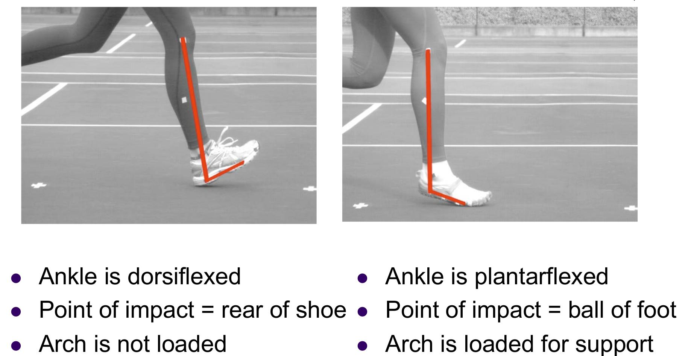

# 跑步

**天生就会跑/Born to Run**一书第二章有两段话，我感觉挺有道理：

>尽管我已经二十年没重读《盖普眼中的世界》了，但却从未忘记书中的一处细节：主人公盖普在每个工作日的中午都要冲出门跑上五英里。跑步是一种独特的体验，它融合了人类的两种原始冲动：恐惧与快感。**无论是害怕了还是快活了，我们都会去跑步。既是奔跑着逃开不幸，也是奔跑着追寻幸福。**

>境况越是糟糕，我们就越拼命去跑。美国的长距离耐力跑运动经历过三次大起大落，每一次兴起都是在国家遭遇危机的时期。第一次是在大萧条时代，两百多个跑步者每天跑四十英里，跨越了美国本土全境，同时掀起了一股浪潮。之后渐渐平息，在七十年代初卷土重来，当时的美国人刚刚经受过越战、冷战、种族暴乱、一名总统犯罪和三名领袖遇刺的打击。第三次则是在9·11过后一年，越野跑忽然成了全美发展势头最猛的户外运动项目。这三次起落或许并非偶然，也许是因为人类心理存在着某种开关机制，**意识到危险来临时，就会激活最原始的求生本能。在缓解压力和营造快感方面，跑步甚至比性更有作为。人类天生就具有奔跑的欲望，需要做的只是将它释放出来。**

想要跑步的朋友，可以看看Papers目录中关于[光脚跑步与穿运动鞋跑步比较的英文论文](Papers/)，也可以看看Youtube上的视频[Barefoot vs. Shod Running](https://youtu.be/Un88ZKZcjJE)，你没有必要光脚跑步，可以考虑穿帆布鞋甚至体操鞋，不要攀比距离，尊重自己身体的感受。除了跑步外，还有很多有趣的运动可以快速燃烧卡路里。

**F • t = m • ∆v**

有很多人认为跑步伤膝盖，其实这是多种原因造成的，根据冲量动量定理，你的体重越大，速度越快，冲击时间越短，地面对你的冲击力也会越大。

从单杠上落地时，动量要比跑步大的多，但是穿平底鞋用前脚掌落地可以极大的延长冲击时间，让冲击力减小到在身体可以承受的范围之内。

长期穿高跟鞋或厚跟的运动鞋，都会让膝关节不停的受到冲击，长期如此膝盖废掉也是可以理解的。运动鞋一般后跟比前跟要高一点，即使你小步慢跑，前脚掌先落地，也不如穿平底帆布鞋时的缓冲时间长。

关于跑步计划，我感觉还是不要过于刻板。如果你强迫自己每天必须跑几公里，过不了几天你就会讨厌这项运动，人们更喜欢随性一点。

## Youtube视频

 - [Barefoot vs. Shod Running](https://youtu.be/Un88ZKZcjJE)
 - Bozeman Science@youtube[Impulse](https://youtu.be/ph48Xwj_eS8)
