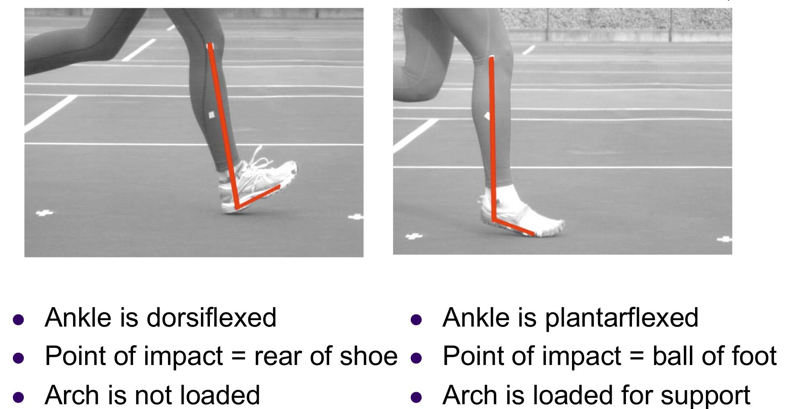

# 跑步

在大学时，我常常为未来感到焦虑不安，感觉自己的专业没有前途，不知道未来在什么方向，内心十分痛苦，所以每周都会绕学校跑好几圈。跑步可以让我内心平静下来，但是跑了那么长时间，我仍然没爱上跑步，跑步只是转移了我的注意力，让我不那么痛苦而已。工作以来，我比大学开心多了，再加上周边适合跑步的环境比较少，当时雾霾也挺严重，于是我不再坚持这项运动了。

**天生就会跑/Born to Run**一书第二章有两段话，我感觉挺有道理：

>尽管我已经二十年没重读《盖普眼中的世界》了，但却从未忘记书中的一处细节：主人公盖普在每个工作日的中午都要冲出门跑上五英里。跑步是一种独特的体验，它融合了人类的两种原始冲动：恐惧与快感。**无论是害怕了还是快活了，我们都会去跑步。既是奔跑着逃开不幸，也是奔跑着追寻幸福。**
>
>**境况越是糟糕，我们就越拼命去跑。**美国的长距离耐力跑运动经历过三次大起大落，每一次兴起都是在国家遭遇危机的时期。第一次是在大萧条时代，两百多个跑步者每天跑四十英里，跨越了美国本土全境，同时掀起了一股浪潮。之后渐渐平息，在七十年代初卷土重来，当时的美国人刚刚经受过越战、冷战、种族暴乱、一名总统犯罪和三名领袖遇刺的打击。第三次则是在9·11过后一年，越野跑忽然成了全美发展势头最猛的户外运动项目。这三次起落或许并非偶然，也许是因为人类心理存在着某种开关机制，**意识到危险来临时，就会激活最原始的求生本能。在缓解压力和营造快感方面，跑步甚至比性更有作为。人类天生就具有奔跑的欲望，需要做的只是将它释放出来。**

想要跑步的朋友，可以看看[Papers目录中的英文论文](Papers/)，也可以看看Youtube上的视频，你没有必要光脚跑步，可以考虑穿帆布鞋甚至体操鞋，不要攀比距离，尊重自己身体的感受。除了跑步外，还有很多有趣的运动可以快速燃烧卡路里。

跑步时尽可能不要穿带减震的跑鞋，那只会让你养成不良的习惯！穿普通帆布鞋，用脚掌前/中部先落地时，小腿的动能会因为其随着落地点转动而被消耗掉，因而对膝盖的冲击会非常小。

关于跑步计划，我感觉还是不要过于刻板。如果你强迫自己每天必须跑几公里，过不了几天你就会讨厌这项运动，人们更喜欢随性一点。

## Youtube视频

 - [Barefoot vs. Shod Running](https://youtu.be/Un88ZKZcjJE)
